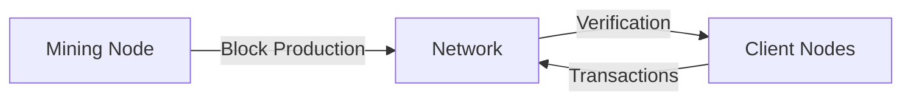

# 🔗 Educational Blockchain Implementation in Python

<div align="center">
  <strong>A comprehensive blockchain implementation showcasing core concepts through Python</strong>
  <br/>
  <br/>
  
  [](https://www.python.org/downloads/)
  [](https://flask.palletsprojects.com/)
  [](LICENSE)
</div>

## 📚 Overview

This project demonstrates a functional blockchain implementation with a modern web interface. Originally developed as a CLI-based hash verification system, it has evolved into a full-stack application featuring simulated mining operations and cryptocurrency transactions.

## 🔍 Core Components

### Block Structure
Each block in our blockchain contains:

```python
{
    "index": 1,
    "timestamp": 1506057125.900785,
    "transactions": [
        {
            "sender": "8527147fe1f5426f9dd545de4b27ee00",
            "recipient": "a77f5cdfa2934df3954a5c7c7da5df1f",
            "amount": 5,
        }
    ],
    "proof": 324984774000,
    "previous_hash": "2cf24dba5fb0a30e26e83b2ac5b9e29e1b161e5c1fa7425e73043362938b9824"
}
```

### 💡 Proof of Work (PoW) Implementation

Our PoW algorithm demonstrates blockchain mining through a simplified example:

```python
from hashlib import sha256

def find_proof_of_work(x):
    y = 0
    while sha256(f'{x*y}'.encode()).hexdigest()[-1] != "0":
        y += 1
    return y

# Example usage
x = 5
solution = find_proof_of_work(x)
print(f'Solution found: y = {solution}')
```

### 📡 API Interface

Example transaction request:
```json
{
    "sender": "wallet_address_1",
    "recipient": "wallet_address_2",
    "amount": 5
}
```

## 🛠️ Technology Stack

- **Backend Framework**: Flask
- **HTTP Client**: Requests
- **Database**: SQLite (for transaction storage)
- **Frontend**: HTML/CSS/JavaScript
- **Cryptography**: hashlib

## 🚀 Getting Started

1. **Clone the Repository**
```bash
git clone https://github.com/your-username/blockchain-python.git
cd blockchain-python
```

2. **Set Up Environment**
```bash
pip install pipenv
pipenv install
pipenv shell
```

3. **Launch Servers**
```bash
# Start mining server
python -m frontend

# Start client (in new terminal)
python -m client <PORT>
```

## 🌐 Network Architecture



## 🔧 Development Features

- ✨ Genesis block generation
- 🔒 Secure hashing algorithms
- ⛏️ Mining simulation
- 💰 Transaction management
- 🌐 Peer-to-peer networking basics

## 📝 Testing

Run the test suite:
```bash
python -m pytest tests/
```

## 🤝 Contributing

1. Fork the repository
2. Create feature branch (`git checkout -b feature/AmazingFeature`)
3. Commit changes (`git commit -m 'Add AmazingFeature'`)
4. Push to branch (`git push origin feature/AmazingFeature`)
5. Open a Pull Request

## 📜 License

Distributed under the MIT License. See `LICENSE` for more information.

---

<div align="center">
  <sub>Built with ❤️ by FeziweMelvin</sub>
</div>
